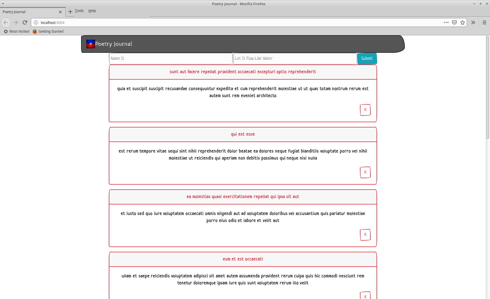

# My Awesome Project
This is a Simple Poetry Journal application that allows you to keep track of flows within a list as well as delete and fetch Fake JSON that is coming from a REST API .

## How It's Made:
This application is made with React. https://reactpoetryjournal.herokuapp.com/

## Optimizations.
All done

## Lessons Learned:
I was trying to use Redux for the state but I am going to have to try to do that with another app. I took out all the redux actions, reducers and etc.

## portfolio:

**WEBSITE:** https:/johnfleurimond.com

## Installation

1. Clone repo
2. run `npm install`

## Usage

1. run `npm start`
